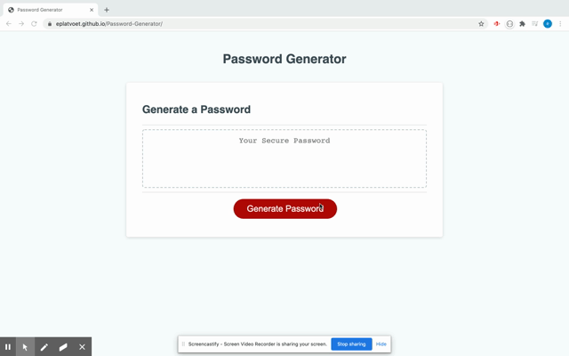

# JavaScript Password Generator
# 

## TABLE OF CONTENTS
- [DESCRIPTION](#DESCRIPTION)  
- [LICENSE](#LICENSE)  
- [INSTALLATION](#INSTALLATION)  
- [TECHNOLOGIES](#TECHNOLOGIES)  
- [QUESTIONS](#QUESTIONS)  
- [CONTRIBUTIONS](#CONTRIBUTIONS)
- [LINKS](#LINKS)  
- [SCREENSHOTS](#SCREENSHOTS) 

## DESCRIPTION
Welcome to the Password Generator. The user is to be able to choose what type of characters they would like their password to contain (uppercase, lowercase, numerical &/or special), and any amount of characters between 8-128.  

## LICENSE
Unlicensed

## INSTALLATION
N/A

## TECHNOLOGIES 
- HTML  
- CSS  
- JavaScript  

## QUESTIONS
My GitHub username is *eplatvoet* & my profile can be found [here](https://github.com/eplatvoet) 

## CONTRIBUTIONS
Feel free to fork the repository if any upgrades/features can be implemented. I can be reached at erin.didomenico520@gmail.com if you have any other questions about this repository.

## LINKS
[REPO](https://github.com/eplatvoet/Password-Generator)
[DEPLOYED](https://eplatvoet.github.io/Password-Generator/)  

## SCREENSHOTS
